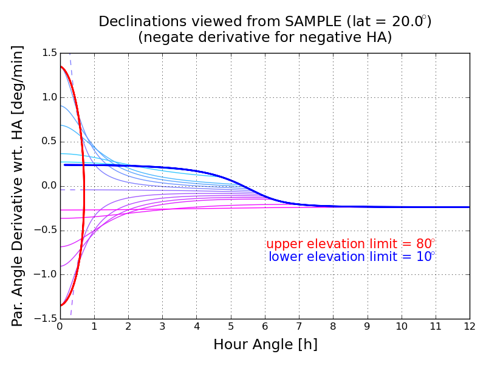

plotparang
=======

Parallactic angle is the angle contructed at a celestial coordinate between a line of constant right ascension and one pointing toward zenith, as viewed from a geographic coordinate.

This simple python script will plot parallactic angle vs hour angle and its derivative for astronomical sources at different declinations, for a user-defined observatory latitude. Curves will be marked with user-defined upper and lower telescope elevation limits. See the code header for user-defined parameters.

For source declinations less than that the observatory latitude, parallactic angle is negative for the source as it rises in the East at negative hour angle. Parallactic angle then becomes positive as the source set in the West at positive hour angle.

This script is released under a BSD 3-Clause License (open source, commercially useable); refer to LICENSE for details.

In case you are wondering, I wrote this script to generate plots for a document regarding radio polarimetry. I will include a link to this document when available.

Sample plots for a range of representative latitudes
=======

Panels in the left column display parallactic angle vs hour angle. Those in the right column display parallactic angle derivative. Rows correspond to observatory latitude, ranging from +80o in the top row to -80o in the bottom row in decrements of 20o.

 
 
 
 
 
 
 
 
 